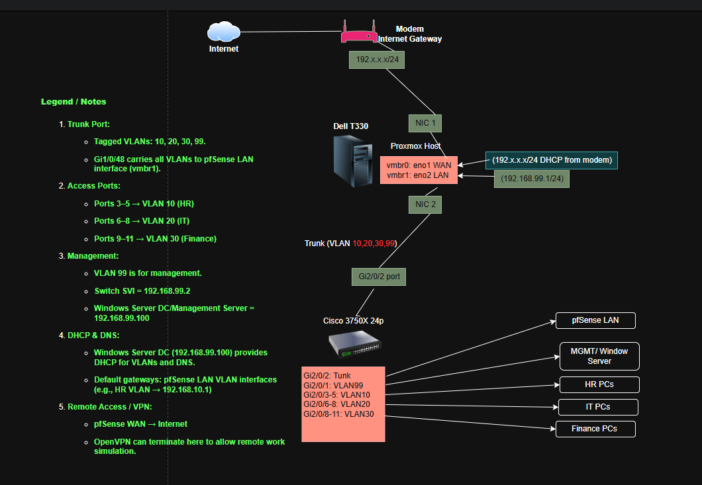
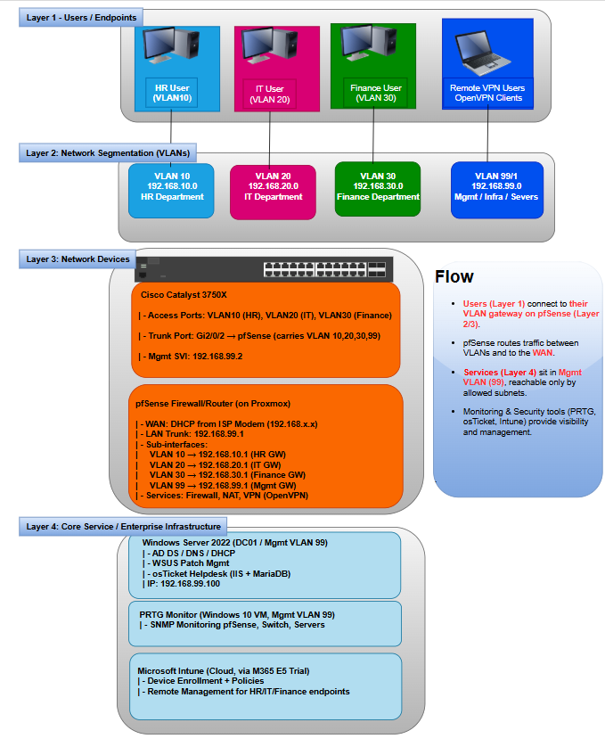

# 🏢 Enterprise IT Lab Infrastructure  

A hands-on **enterprise-grade homelab project** simulating a corporate IT environment.  
This lab demonstrates skills across **Active Directory, Networking, pfSense Firewall, Cisco Switching, VPN, File Sharing, and Network Monitoring** — the same tools and workflows used in enterprise IT.  

This portfolio highlights my ability to **design, deploy, and manage enterprise infrastructure** in a secure, structured, and documented way.  

---

## 📌 Project Overview
This lab was built on a **Dell PowerEdge T330 server** running Windows Server 2022, pfSense, Cisco Catalyst 3750X, and multiple Windows 10 clients.  

### Key Features:
- **Active Directory Domain Services (AD DS)** with OUs for HR, IT, Finance
- **Group Policy Objects (GPOs)** for drive mapping, password enforcement, USB restrictions
- **pfSense Firewall** with WAN/LAN, inter-VLAN routing, and VPN (OpenVPN)
- **Cisco Catalyst 3750X** VLAN segmentation (HR, IT, Finance, Management)
- **DHCP & DNS** integrated with pfSense + AD
- **SNMP Monitoring** with PRTG / LibreNMS
- **NTFS File Permissions** for secure file shares per department

---

## 🖥️ Lab Architecture

### 🔹 Network Topology (Visual)
This diagram shows physical connectivity and VLAN segmentation:

### 🔹 High-Level Enterprise Architecture
Layered view of users, VLANs, network devices, and core services:

---

## 📂 Step-by-Step Documentation

Full guides are inside the **[docs/](docs/)** folder:  

- [Active Directory Setup](docs/ActiveDirectory.md)  
  *Install AD DS, promote domain controller, create OUs, users, and GPOs.*  

- [pfSense + Cisco VLAN Lab](docs/pfSense_Cisco.md)  
  *Configure pfSense LAN/WAN, firewall rules, VLAN trunking, and client isolation.*  

- [VPN & Remote Work](docs/vpn-config.md)  
  *Enable OpenVPN for secure remote access.*  

- [Monitoring & SNMP](docs/Monitoring.md)  
  *PRTG/LibreNMS setup with SNMP, alerts, and network map.*  

---

## 🔐 Security & Policies
- Password Policies (min length, complexity, expiry)  
- USB Device Blocking via GPO  
- VLAN Segmentation (HR cannot access IT resources)  
- pfSense Firewall rules for traffic control  
- VPN for remote employees  

---

## 📊 Monitoring & Reporting
- **PRTG / LibreNMS Dashboard** monitors traffic, uptime, and CPU usage.  
- SNMP-enabled devices include pfSense firewall, Cisco switch, and Windows Server.  

*Screenshots available in the `images/` folder.*

---

## 🚀 Skills Demonstrated
- **Windows Server Administration**: AD DS, GPO, DNS, DHCP  
- **Network Engineering**: Cisco VLANs, trunking, inter-VLAN routing  
- **Firewall & Security**: pfSense rules, VPN, subnet isolation  
- **Monitoring & Alerts**: SNMP, dashboards, reporting  
- **Documentation & Portfolio Building**: GitHub project showcase  

---

## 📈 Why This Project Matters
This lab simulates the **daily responsibilities of an IT Support / IT Analyst role** in enterprise environments:
- Managing users, groups, and access control  
- Enforcing IT security policies  
- Configuring switches, firewalls, and VLANs  
- Monitoring infrastructure health  
- Supporting remote employees securely  

---

## 📬 Contact
👤 **Your Name**  
💼 Aspiring **IT Support Specialist | IT Analyst | Cybersecurity Professional**  
📧 [your.email@example.com]  
🔗 [LinkedIn Profile](https://www.linkedin.com/)
